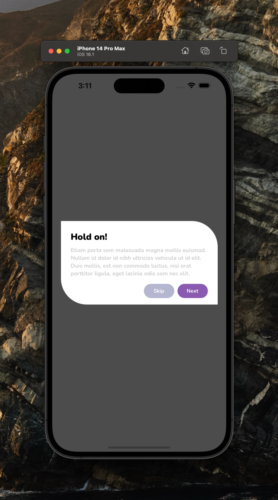

[](https://github.com/WrathChaos/react-native-basic-modal)

[](https://github.com/WrathChaos/react-native-basic-modal)

[](https://www.npmjs.com/package/react-native-basic-modal)
[](https://www.npmjs.com/package/react-native-basic-modal)

[](https://opensource.org/licenses/MIT)
[](https://github.com/prettier/prettier)

<p align="center">
  
</p>

# Installation

Add the dependency:

```ruby
npm i react-native-basic-modal
```

## Peer Dependencies

###### IMPORTANT! You need install them

```json
"react-native-modal": ">= 11.4.0"
```

# Usage

## Import

```js
import BasicModal, { Button } from "react-native-basic-modal";
```
## BasicModal Usage

### Default Usage

```jsx
<BasicModal isVisible />
```


### Customizable Usage

```jsx
<BasicModal 
  isVisible
  title="Warning!" 
  desciption="Lorem Ipsum is simply dummy text of the printing and typesetting industry. Lorem Ipsum has been the industry's standard dummy text ever since the 1500s, when an unknown printer took a galley of type and scrambled it to make a type specimen book."
  firstButtonOnPress={()=> {}}  
  secondButtonOnPress={()=> {}}  
/>
```

## HalloweenModal

### Important note: You need to add "halloweenTheme" prop!

```jsx
<HalloweenModal halloweenTheme isVisible />
```

You can use the same customization options as BasicModal. HalloweenModal just a special theme for Halloween :)


### How can I hide the modal by pressing outside of its content?

The prop `onBackdropPress` allows you to handle this situation:

```jsx
<BasicModal
  isVisible={this.state.isVisible}
  onBackdropPress={() => this.setState({ isVisible: false })}
/>
```

# For more FAQ about Modal: 

#### [Modal FAQ](https://github.com/react-native-community/react-native-modal#frequently-asked-questions)

# Configuration - Props

| Property                    |   Type    |  Default  | Description                                  |
| --------------------------- | :-------: | :-------: | -------------------------------------------- |
| width                       |  number   |    90%    | change the modal's width                     |
| height                      |  number   |    185    | change the modal's height                    |
| isVisible                   |   bool    |   false   | set the modal's visibility                   |
| title                       |  string   | Hold on!  | set your own title text                      |
| description                 |  string   | too long  | set your own description text                |
| titleColor                  |   color   |  #212121  | change the title's text color                |
| descColor                   |   color   |  #b5b5b5  | change the description's text color          |
| titleStyle                  |   style   |   style   | set your own style for title text            |
| descStyle                   |   style   |   style   | set your own style for description text      |
| backgroundColor             |   color   |   #fff    | change the modal's background color          |
| firstButtonText             |  string   |   SKIP    | set your own button text                     |
| secondButtonText            |   color   |   NEXT    | set your own button text                     |
| firstButtonTextColor        |   color   |   #fff    | change the first button's text color         |
| secondButtonTextColor       |   color   |   #fff    | change the second button's text color        |
| firstButtonBackgroundColor  |   color   |  #b5b6cf  | change the first button's background color   |
| secondButtonBackgroundColor |   color   |  #895aaf  | change the second button's background color  |
| firstButtonOnPress          | function  | undefined | set your own onPress function                |
| secondButtonOnPress         | function  | undefined | set your own onPress function                |
| firstButtonComponent        | component |  default  | set your own button component for first one  |
| secondButtonComponent       | component |  default  | set your own button component for second one |


## Credits

Thank you so much for this awesome theme assets for **[Adem 'Allecroom' Kotan](https://dribbble.com/Allecroom)**
You can hire him for 2D, 3D assets :) 

### **[Hire him!](mailto:alperademkotan@gmail.com)**

Also, I inspired by [Orizon Design](https://www.instagram.com/p/BtHuW3sBpkG/) Thank you so much guys, nice UI / UX :)

## Future Plans

- [x] ~~LICENSE~~
- [x] ~~Halloween Theme~~
- [ ] Write an article about the lib on Medium

# Change Log

## [0.0.5](https://github.com/WrathChaos/react-native-basic-modal/tree/0.0.5) (2019-10-13)
[Full Changelog](https://github.com/WrathChaos/react-native-basic-modal/compare/0.0.1...0.0.5)

## [0.0.1](https://github.com/WrathChaos/react-native-basic-modal/tree/0.0.1) (2019-10-13)
[Full Changelog](https://github.com/WrathChaos/react-native-basic-modal/compare/0.0.2...0.0.1)

\* *This Change Log was automatically generated by [github_changelog_generator](https://github.com/skywinder/Github-Changelog-Generator)*

## Author

FreakyCoder, kurayogun@gmail.com

## License

React Native Basic Modal is available under the MIT license. See the LICENSE file for more info.
